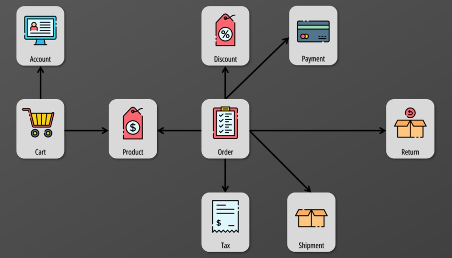
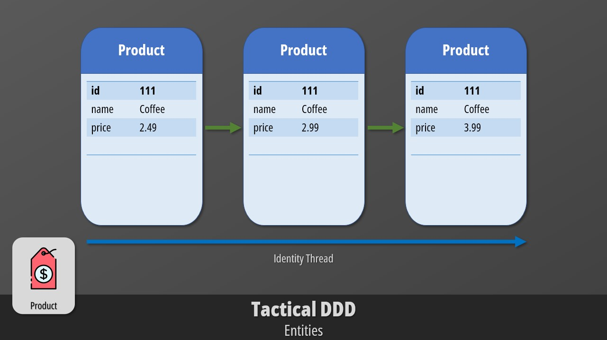
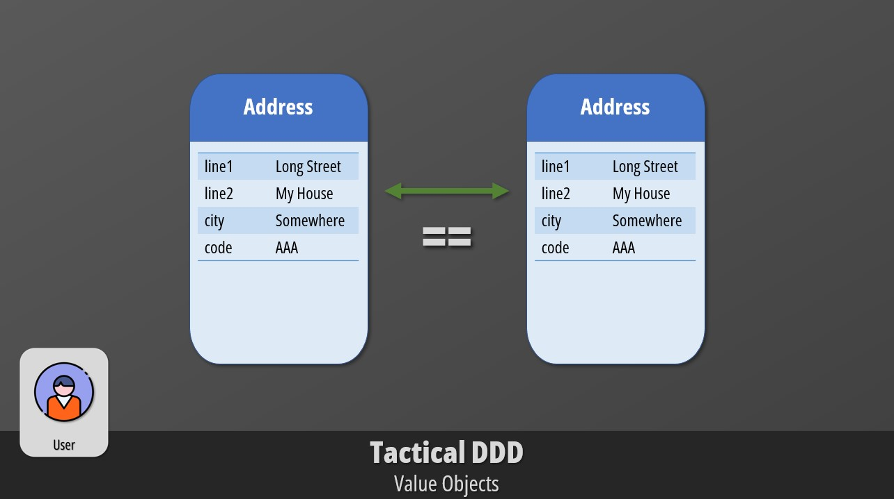
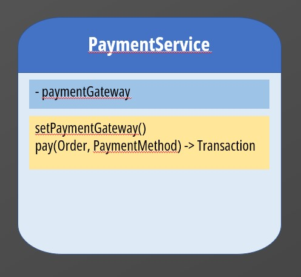
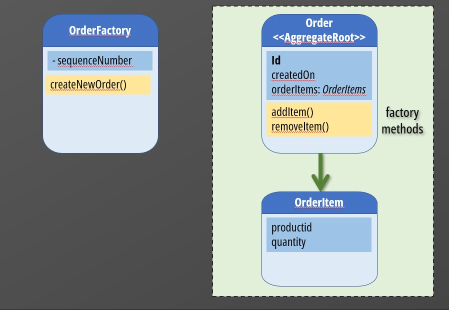
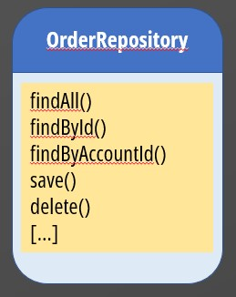
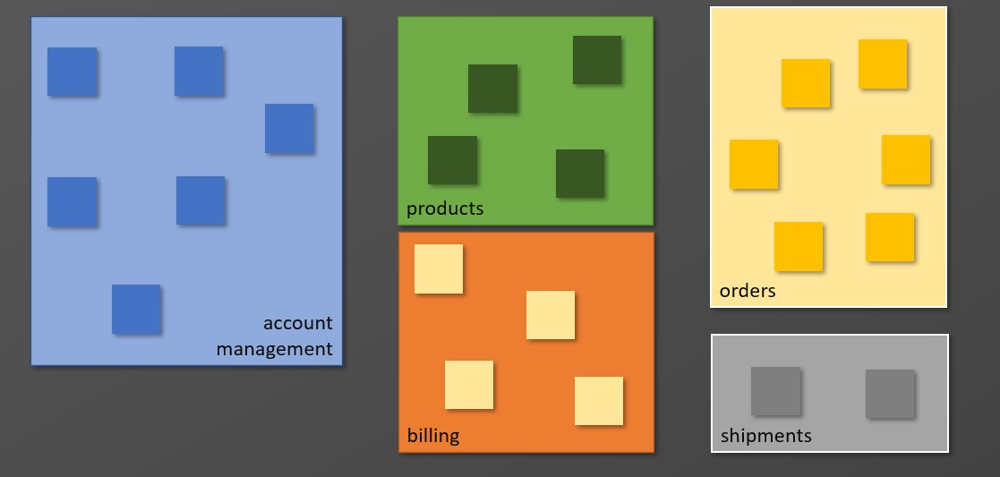
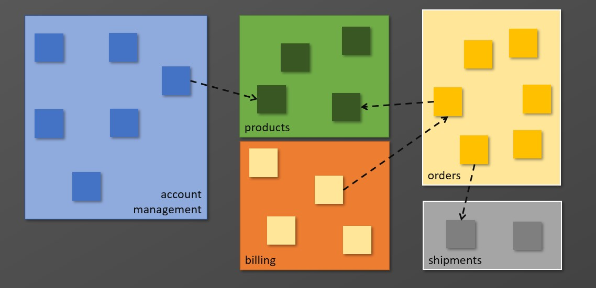
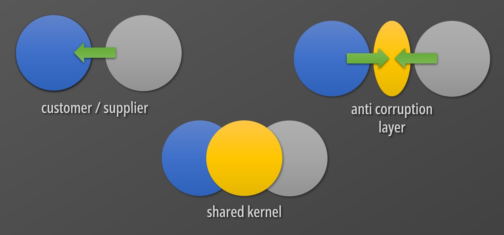

Domain Driven Design (DDD) is one of the pillars of object oriented software development. You must understand it really well if you want to produce future proof code and designs. Despite it looks intimidating to most developers, the concepts of DDD are really straight-forward and to some extent based on some principles that can be applied to problem solving in general and not just to software development. Let’s cover them in the next few minutes.



## What is a Domain?

**A domain is the subject of a software system or application.**

Let’s imagine that we are tasked to build an online store. The domain of our software is everything that is related or necessary to operate the store. Accounts, products, carts, orders, shipments, returns, payments, discounts, taxation, etc., are just a few examples of tangible and intangible things that are part of our domain.

We immediately realize that the domain of our online store is much more complex than we initially thought. It may also require expertise from different disciplines other than software itself like marketing, accounting and law. How can software developers or architects deal with such complexity?

The answer is we create a Domain Model.

## What is a Domain Model?

**A Domain Model is a simplified and structured abstraction that maps and documents everything of interest in the Domain.** Its main goals are to distill knowledge and create a shared (ubiquitous) language and understanding among all stakeholders from software developers to executives.

For the domain model to be effective, it has to be binding! It’s like a contract!

Everyone in the company must use its terminology. If we named something Cart, everyone needs to use that term. Trolley, Basket, Shopping List are not allowed. They would just create confusion and misunderstandings. Most importantly, software developers need to abide by it and implement it as documented. Otherwise, the end result is a system that does not behave as intended.

## Designing a Model

How do we design a model?

We divide the design into two phases:

- Tactical Design
- Strategic Design

In the tactical phase we focus on the lower level details of the model, while in the strategic one we look at the big picture.

### Tactical Design

During the tactical design phase, we use the building blocks of DDD to create a detailed view of our model. We use Entities, Value Objects, Associations and other constructs.

#### **Entities**

Let’s start by defining entities.

**An Entity is a class mapping a subject or object with a well defined identity and lifecycle.**

Entities must have unique identifiers since their equality is not based on their properties. You can have two users with the same first name and last name, thus you need to add an identifier to distinguish them.

During the life-cycle of an entity, its state might change while the thread of identity is continued. Imagine a Product whose price fluctuates while its identity is constant.

#### **Value Objects**

**A Value Object represents an element of the model that has no conceptual identity.** Two value objects are equal when their properties are equal.

Imagine an Address defined by these properties. If you have two instances of this class with the same values, those instances are considered equal.

Value Objects enrich the model with details. In fact, they are often used within Entities to keep them lean. The address could be defined as a property of the user entity. Once the user is deleted, the address is deleted with it as well.

#### **Associations**

**Objects in a domain are interconnected by some sort of relationship. That’s known as an association.**

Most relationships in real life are bi-directional. An order contains one or more products, while a product can be part of multiple orders. That’s an example of a many to many relationship.

Such relationships are difficult to implement and maintain in code. For this reason, we can optimize our model by imposing a traversal direction. In our scenario, I would favor the direction starting from Order. It is the most natural one. When we visualize an order we want to see the products, while the reverse will be extremely rare. We indicate this in diagrams by using an open arrow end.

Other options to simplify associations are to leverage one-to-one and one-to-many relationships. An account can be restricted to only one cart. While the relationship between order and order items is one-to-many. An order has many order items, but an order item can belong only to one order.

#### **Services**

At times it might be difficult to represent a concept as an Entity or ValueObject in our model. This is common when we want to map an operation rather than someone or something. In these cases, we can use services.

A Service is a stateless operation whose interface is defined by other elements of the model. The service stands alone in the model and has no associations. We could create a service that accepts an Order and PaymentMethod, perform the actual payment and returns the transaction details.

Services are very common in frameworks. Unfortunately, they are also abused. It is not uncommon to see [Anemic Models](https://martinfowler.com/bliki/AnemicDomainModel.html). In these models all the logic is stored in services while entities are simply sterile bags of data with no behavior. This is against the core idea of DDD. Each Entity should encapsulate behavior. For example, the entity should prevent its state from being corrupted, you should not rely on some other external class to do that.

#### **Aggregates and Factories**

When the model starts growing large, we use aggregates to group a set of closely related entities. We establish a boundary and a root which we use to control all access to the objects inside. This way we can simplify our model by allowing references only to Aggregate Roots and we can guarantee sanity of the entire aggregate as a whole. Order and Order Item are a perfect example of an aggregate, where Order is the root.

To build and interact with complex objects like Aggregates, we can use Factories. Factories could be methods, for example we could expose a method on Orders to create new line items. Factories can also be standalone classes which generate aggregates or entities. For example, we could have an OrderFactory generating sequentially numbered Orders.

#### **Repositories**

And finally, we have repositories that are used to retrieve particular instances of our entities. Their main goal is to avoid crowding the entity with querying and persistence concerns which would bloat it.

We can create an OrderRepository where we can fetch orders by ID, Account, or Date Range.

### Stategic Design

#### **Bounded Context**

As we noticed, a common concern during modeling is reducing complexity. The answer is always to introduce some form of boundary that allows us to focus on a particular aspect of our domain and reduce the complexity of all the possible associations within its objects.

The larger the project we are working on, the higher are the chances that creating a unified model is not feasible. We might need multiple teams to work concurrently to deliver the entire model.

In the Strategic Design phase, we decompose our model into distinct sub-models by creating bounded contexts. Within the bounded context, we are able to continuously build, test and optimize the model independently from other contexts. We can also specialize its function and create a more precise dialect that is used by the team members and experts involved in it.

If you are wondering if there is any relation with microservices, you are spot on. Strategic DDD is very commonly used to define the competencies of a particular microservice. I will talk more about that in another article.

#### **Context Map**

Relationships obviously exist between bounded contexts and as we learnt they can become complex very quickly. To address this issue we can create a Context Map where we document the points of contact between the different models. An effective context map defines clear names and boundaries for each context that are shared by all teams.

#### **Relationships**

The relationships between models and teams are even more complex than the associations we have seen in tactical design. This is because they not only affect data and features, but they actually impact the way different software development teams interact to integrate their domains. There are several ways to govern these relationships.

You could have a team acting as a customer to another team, that’s known as the custom / supplier relationship. Another approach could be to have two or more teams share a portion of their models where they collaborate, that’s the Shared Kernel.

Another common approach, especially when dealing with models outside our control, is to create an Anti-corruption Layer, which allows us to keep our model focused on its subject and use this layer to perform the translation to another model. This way we avoid direct relationships and increase decoupling between the two models.

## Conclusion

As you can imagine, tactical and strategic design can become really complex and we just touched very few aspects of them. Most of the information I shared is based on the book by [Eric Evans, Domain Driven Design](https://www.amazon.com/Domain-Driven-Design-Tackling-Complexity-Software/dp/0321125215/). If you want me to cover a bit more, let me know through comments or leave a message on my socials.

See you next time 🙂