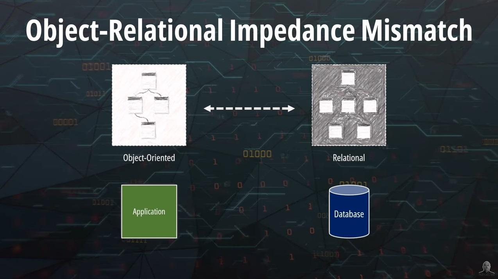

In this article, we explain the concept of anemic model which is extremely common in modern applications. We also try to identify why anemic models are so popular, as well as proposing solutions to mitigate this issue. 



## What is an Anemic Model?

**A model is anemic when its objects have no behavior.**

At first sight an anemic model looks legit, classes have the proper nouns we defined in our original design and even relationships are correct. However, when we look deeper, we see that each class is just a bag of getters and setters. **There is only state and no business logic.**

Now I’m sure that if you go look at your own codebase, there are high chances that you have an anemic model too!

Don’t panic! Truth is that today this is very common. This is also the reason why you will find a ton of videos and blog posts telling you that domain driven design is dead. Unfortunately, that’s true. But that’s also the reason why most codebases end up in spaghetti code.

## Why is an anemic model bad?

**An anemic model breaks some fundamental object-oriented programming principles. The most important is encapsulation.**

Think about it. We have created an object and rather than protecting its properties from external corruption and abstracting implementation details, we allow anyone to modify their values through public setters. This is equivalent to make the property public in the first place.

**Who is ensuring that the object is in a valid state?**

Imagine if we had a business rule stating that the maximum weight for a package is 30Kg. 

The correct place to implement this rule is within the Package class itself. Every time we create a package or add a new item to the package, we can verify the current weight and deny the request if we go over the limit. 

If we don’t implement this rule within the package, what guarantees do we have that it is implemented somewhere else?

## Why are Anemic Models very common?

Now you might be thinking, but if this is so wrong why is everyone leveraging anemic models today?

I think the most common reason is that **we tend to think that the model we derive from DDD is just a data model.** 

In other words, it is a map describing how data should be persisted on the database. But that’s not the case. 

**The domain model is meant to be The Business Model where the core logic of our application is implemented.**

I also think some tooling like ORM libraries and IoC frameworks contributed to cement the practice of using a DDD model as a plain data model.

### Object-Relational Mapping (ORM)

If we are using a relational database, we are most probably relying on an ORM library such as Hibernate, SQLAlchemy or GORM.

ORM stands for Object-relational mapping, and it is the process of mapping our objects into relational database structures. ORM is necessary because of the object / relational impedance mismatch. A relational database cannot store objects. Hence, we need to perform a translation. For instance, there is no inheritance in a relational database, thus we cannot create a table that inherits all the fields from a parent table. 

The need of creating this translation layer from the object world to the relational world might be the reason why we create a plain data model without logic. This issue is even more pronounced when we use the ORM library to reverse engineer our data model from a database schema.

A way to circumvent this issue is to move to a NoSQL database like MongoDB where aggregates can be stored as documents. This way we remove completely the need of mapping class diagrams to ER diagrams.

### Invertion of Control (IoC) frameworks

Another common approach that leads to anemic models is the practice of stuffing all our logic in a service layer. If you use an inversion of control (IoC) framework like Spring in Java, this is very common. 

In this setup, developers tend to create three layers in the application. We have the upper layer used to handle incoming API requests. Then, we create a layer of services. And finally, we would have repositories used to interact with the database. The model would exist in the form of a data model that is manipulated by the service layer. The business logic would exist in the services and not in the model itself.

This is perfectly fine for simple CRUD applications but once the model grows in complexity, it just becomes spaghetti code. These services are generally not part of the domain model we designed in advance and the result is that the business logic affecting a particular entity could be sparse in multiple services. We also have the issue that services depend often on each other and relationships between them are not immediately clear.

## How can we avoid Anemic Models?

The idea is very simple. 

**Start placing the business logic within the object itself whenever possible!** For example, defend the state of an object from within. Stop creating public setters for every single field and do not rely on external services for validation.

We can also apply the [TellDontAsk principle](https://martinfowler.com/bliki/TellDontAsk.html) that Martin Fowler mentions in his blog that it reminds us that rather than asking an object for data and acting on that data, we should instead **tell an object what to do.** This encourages to move behavior into an object to go with the data.

*Screenshot taken from https://martinfowler.com/bliki/TellDontAsk.html*

## Conclusion

That’s all for today!

We have learnt that a model is anemic when it does contain business logic. Usually, this logic is sparsed on other objects that do not belong to the original domain design. We just need to be aware of this issue and try to squeeze more logic in our domain.

What do you think? Will you try to put more business logic in your model?